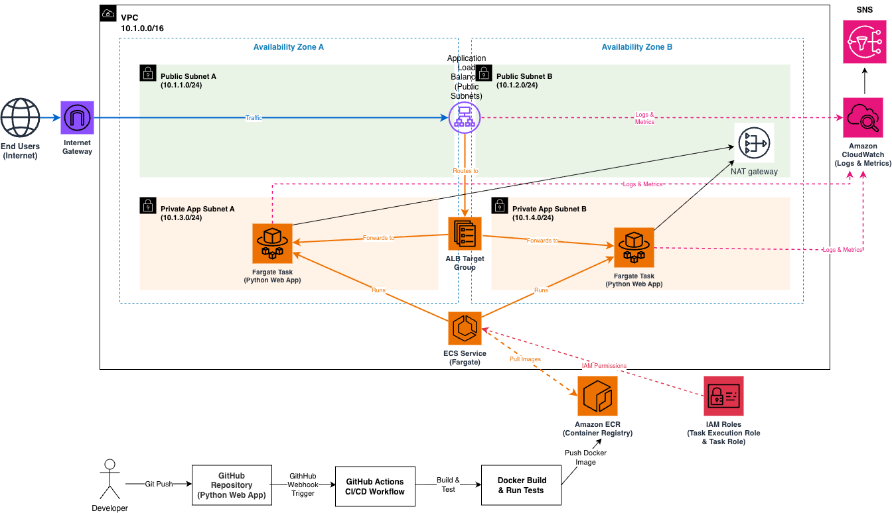

# Containerised ECS Fargate Web Application

This project demonstrates how to deploy a production-style containerised application on AWS using Terraform, ECS Fargate and GitHub Actions.

The infrastructure provisions a highly available web application behind an Application Load Balancer, with automated CI/CD deployments triggered on every push to the main branch.

---

# Architecture Overview

The system consists of the following components:

- **VPC** with public and private subnets across two Availability Zones
- **Application Load Balancer (ALB)** for distributing incoming HTTP traffic
- **Amazon ECS Fargate** for running containerised application tasks
- **Amazon ECR** for storing Docker images
- **GitHub Actions CI/CD pipeline** for automated deployments
- **CloudWatch alarms and SNS notifications** for monitoring

Application containers are built using Docker, pushed to ECR and deployed to ECS automatically via the CI/CD pipeline.

---

## Architecture Principles

This architecture was designed following several core cloud design principles:

- High availability across multiple Availability Zones
- Secure network segmentation using private subnets
- Infrastructure managed entirely through Terraform
- Containerised application deployment using ECS Fargate
- Automated deployments using CI/CD
- Health-based traffic routing via ALB

---

# Architecture Diagram

---

# Terraform Structure

The Terraform code is organised into reusable modules.

- vpc
- alb
- ecs
- ecr

Each module is responsible for a specific infrastructure component.

| Module | Purpose                                              |
|--------|------------------------------------------------------|
| VPC    | Networking, subnets, routing, NAT gateway            |
| ALB    | Application Load Balancer and target groups          |
| ECS    | ECS cluster, task definitions and service            |
| ECR    | Container image repository                           |

---

# Application

A simple Python HTTP server is containerised using Docker and deployed to ECS Fargate.

Endpoints include:

| Endpoint   | Description                                      |
|------------|--------------------------------------------------|
| /          | Returns a simple application response            |
| /health    | Used by the ALB health check                     |
| /hostname  | Returns the container instance identifier        |

The /hostname endpoint helps demonstrate load balancing across multiple containers.

---

# CI/CD Pipeline

A GitHub Actions workflow automates the deployment process.

On every push to the main branch:

- Docker image is built
- Image is tagged and pushed to Amazon ECR
- ECS service is updated to trigger a new deployment

This removes manual deployment steps and enables continuous delivery of application updates.

---

# Design Decisions

### Containerised Deployment (ECS Fargate)

The application is packaged as a Docker container and deployed using ECS Fargate.

This removes the need to manage EC2 instances and provides a serverless container runtime, simplifying infrastructure management and scaling.

---

### Private Subnets for Compute

ECS tasks are deployed in private subnets so they are not directly accessible from the public internet.

All incoming traffic must pass through the Application Load Balancer.

This reduces the attack surface and improves overall security.

---

### Application Load Balancer

An Application Load Balancer (ALB) is deployed in public subnets and acts as the entry point for user traffic.

The ALB distributes incoming HTTP requests across ECS tasks running in multiple Availability Zones.

Health checks are configured on the /health endpoint to ensure only healthy containers receive traffic.

---

### ECS Service and Task Management

ECS manages container lifecycle and ensures the desired number of tasks are always running.

If a task fails, ECS automatically replaces it.

This provides self-healing behaviour and ensures application availability.

---

### Amazon ECR

Docker images are stored in Amazon ECR.

This provides a secure, private container registry that integrates directly with ECS.

---

### CI/CD with GitHub Actions

The deployment pipeline automates:

- building Docker images
- pushing images to ECR
- triggering ECS deployments

This enables consistent and repeatable deployments without manual intervention.

---

### CloudWatch Monitoring

CloudWatch is used to monitor infrastructure and application behaviour.

Metrics such as ALB errors can trigger alarms which publish to an SNS topic.

This provides basic observability and alerting.

---

# How to Deploy

### 1. Clone the repository

git clone https://github.com/olamideetimiri/terraform-aws-ecs-fargate-webapp

cd terraform-aws-ecs-fargate-webapp

---

### 2. Create your variables file

Copy the example variables file and update values if necessary.

cp terraform.tfvars.example terraform.tfvars

---

### 3. Initialise Terraform

terraform init

---

### 4. Review the infrastructure plan

terraform plan

---

### 5. Deploy the infrastructure

terraform apply

---

### 6. Configure GitHub Actions secrets

In your GitHub repository, add the following secrets:

- AWS_ACCESS_KEY_ID
- AWS_SECRET_ACCESS_KEY

These are required for the CI/CD pipeline to deploy to AWS.

---

### 7. Trigger a deployment

Push a change to the repository:

git add .  
git commit -m "update app"  
git push  

This will trigger the GitHub Actions pipeline.

---

# Testing

After deployment, retrieve the ALB DNS name:

terraform output alb_dns_name

Then test the following endpoints:

/ → application response  
/health → returns OK  
/hostname → shows which container handled the request  

Refreshing /hostname should return different values, demonstrating load balancing.

---

# Cleanup

- terraform destroy

---

# Technologies Used

- AWS
- Terraform
- Docker
- Amazon ECS Fargate
- Amazon ECR
- GitHub Actions
- Python
